# ER図 - データベース設計

## 概要

財務実践学習アプリケーションのデータベース設計を表すER図です。ユーザー管理、プロジェクト管理、学習管理、進捗管理を中心とした設計になっています。

## メインER図

```mermaid
erDiagram
    %% ユーザー管理
    users {
        uuid id PK "ユーザーID"
        varchar email UK "メールアドレス"
        varchar password_hash "パスワードハッシュ"
        varchar display_name "表示名"
        varchar role "ロール(admin/user)"
        jsonb preferences "ユーザー設定"
        timestamp created_at "作成日時"
        timestamp updated_at "更新日時"
        timestamp last_login_at "最終ログイン"
        boolean is_active "有効フラグ"
    }

    %% プロジェクト管理
    projects {
        uuid id PK "プロジェクトID"
        uuid user_id FK "ユーザーID"
        varchar name "プロジェクト名"
        text description "説明"
        varchar phase "フェーズ(planning/development/maintenance)"
        varchar accounting_treatment "会計処理(expense/asset)"
        bigint budget "予算額"
        integer timeline_months "期間(月)"
        jsonb cost_breakdown "コスト内訳"
        jsonb decision_criteria "判断基準"
        timestamp created_at "作成日時"
        timestamp updated_at "更新日時"
    }

    %% 財務データ
    financial_statements {
        uuid id PK "財務諸表ID"
        uuid project_id FK "プロジェクトID"
        varchar statement_type "諸表種別(pl/bs/cf)"
        varchar period "期間"
        jsonb data "財務データ(JSON)"
        jsonb assumptions "前提条件"
        timestamp created_at "作成日時"
        timestamp updated_at "更新日時"
    }

    %% 予算管理
    budget_plans {
        uuid id PK "予算計画ID"
        uuid project_id FK "プロジェクトID"
        varchar name "計画名"
        jsonb items "予算項目リスト"
        jsonb analysis "分析結果"
        decimal roi_percentage "ROI(%)"
        decimal irr_percentage "IRR(%)"
        bigint npv_amount "NPV"
        decimal payback_years "回収期間(年)"
        timestamp created_at "作成日時"
        timestamp updated_at "更新日時"
    }

    %% 学習管理
    case_studies {
        uuid id PK "ケーススタディID"
        varchar title "タイトル"
        text description "説明"
        varchar category "カテゴリ"
        varchar difficulty "難易度(beginner/intermediate/advanced)"
        integer estimated_time "想定時間(分)"
        text scenario "シナリオ"
        jsonb company_profile "企業情報"
        jsonb project_details "プロジェクト詳細"
        jsonb questions "問題リスト"
        jsonb solutions "解答・解説"
        text learning_objectives "学習目標"
        varchar tags "タグ(配列)"
        boolean is_active "有効フラグ"
        timestamp created_at "作成日時"
        timestamp updated_at "更新日時"
    }

    exercises {
        uuid id PK "演習ID"
        varchar title "タイトル"
        text description "説明"
        varchar exercise_type "演習タイプ(roi/irr/depreciation/budget/accounting)"
        varchar difficulty "難易度"
        jsonb parameters "パラメータ"
        jsonb expected_answer "期待回答"
        text explanation "解説"
        varchar related_concepts "関連概念"
        boolean is_active "有効フラグ"
        timestamp created_at "作成日時"
        timestamp updated_at "更新日時"
    }

    %% 学習進捗管理
    learning_progress {
        uuid id PK "進捗ID"
        uuid user_id FK "ユーザーID"
        integer overall_progress "全体進捗(%)"
        jsonb module_progress "モジュール別進捗"
        jsonb weak_areas "弱点エリア"
        jsonb achievements "実績リスト"
        timestamp last_updated "最終更新"
    }

    case_study_attempts {
        uuid id PK "挑戦ID"
        uuid user_id FK "ユーザーID"
        uuid case_study_id FK "ケーススタディID"
        varchar status "状態(not_started/in_progress/completed)"
        integer score "得点"
        integer time_spent "所要時間(分)"
        integer questions_answered "回答数"
        integer questions_correct "正解数"
        jsonb answers "回答データ"
        timestamp started_at "開始時刻"
        timestamp completed_at "完了時刻"
        integer attempt_number "挑戦回数"
    }

    exercise_attempts {
        uuid id PK "挑戦ID"
        uuid user_id FK "ユーザーID"
        uuid exercise_id FK "演習ID"
        varchar status "状態(not_started/in_progress/completed)"
        decimal score "得点"
        decimal user_answer "ユーザー回答"
        boolean is_correct "正解フラグ"
        integer time_spent "所要時間(分)"
        timestamp submitted_at "提出時刻"
        integer attempt_number "挑戦回数"
    }

    %% 学習セッション
    learning_sessions {
        uuid id PK "セッションID"
        uuid user_id FK "ユーザーID"
        varchar activity_type "活動タイプ(case_study/exercise/reading)"
        uuid activity_id "活動ID"
        varchar activity_name "活動名"
        timestamp started_at "開始時刻"
        timestamp ended_at "終了時刻"
        integer duration_minutes "継続時間(分)"
        decimal score "スコア"
        boolean completed "完了フラグ"
        jsonb metadata "メタデータ"
    }

    %% 実績・バッジ
    achievements {
        uuid id PK "実績ID"
        varchar name "実績名"
        text description "説明"
        varchar icon "アイコン"
        varchar category "カテゴリ(completion/score/streak/time/special)"
        varchar rarity "レア度(common/rare/epic/legendary)"
        jsonb criteria "獲得条件"
        boolean is_active "有効フラグ"
        timestamp created_at "作成日時"
    }

    user_achievements {
        uuid id PK "ユーザー実績ID"
        uuid user_id FK "ユーザーID"
        uuid achievement_id FK "実績ID"
        timestamp unlocked_at "獲得日時"
        jsonb metadata "メタデータ"
    }

    %% システム設定
    system_settings {
        varchar key PK "設定キー"
        jsonb value "設定値"
        text description "説明"
        timestamp updated_at "更新日時"
    }

    %% 関連定義
    users ||--o{ projects : "creates"
    users ||--o{ learning_progress : "tracks"
    users ||--o{ case_study_attempts : "attempts"
    users ||--o{ exercise_attempts : "attempts"
    users ||--o{ learning_sessions : "participates"
    users ||--o{ user_achievements : "earns"
    
    projects ||--o{ financial_statements : "generates"
    projects ||--o{ budget_plans : "has"
    
    case_studies ||--o{ case_study_attempts : "attempted_in"
    exercises ||--o{ exercise_attempts : "attempted_in"
    
    achievements ||--o{ user_achievements : "awarded_as"
    
    learning_progress ||--o{ learning_sessions : "recorded_in"
```



## テーブル詳細

### コアエンティティ

#### users（ユーザー）
ユーザーアカウント情報と基本設定を管理します。

- **主要フィールド**:
  - `id`: UUID主キー
  - `email`: 一意のメールアドレス
  - `password_hash`: bcryptハッシュ化パスワード
  - `role`: admin/user（将来の権限管理用）
  - `preferences`: JSON形式のユーザー設定

#### projects（プロジェクト）
ユーザーが作成するシステム開発プロジェクトの情報を保存します。

- **主要フィールド**:
  - `accounting_treatment`: expense/asset（会計処理方法）
  - `cost_breakdown`: JSON形式のコスト内訳
  - `decision_criteria`: 判断基準のチェック状況

### 学習管理エンティティ

#### case_studies（ケーススタディ）
アプリケーションで提供される学習用ケーススタディのマスターデータです。

- **JSON フィールド**:
  - `questions`: 問題リスト（選択肢、正解、解説含む）
  - `company_profile`: 企業情報（業界、規模、売上等）
  - `project_details`: プロジェクト詳細（予算、期間、チーム等）

#### exercises（演習問題）
ROI計算、減価償却等の計算演習問題のマスターデータです。

- **演習タイプ**:
  - `roi`: ROI計算問題
  - `irr`: IRR計算問題  
  - `depreciation`: 減価償却問題
  - `budget`: 予算管理問題
  - `accounting`: 会計処理問題

### 進捗管理エンティティ

#### learning_progress（学習進捗）
ユーザー単位での学習進捗の総合情報を管理します。

#### case_study_attempts（ケーススタディ挑戦）
ユーザーのケーススタディ挑戦履歴と結果を記録します。

#### exercise_attempts（演習挑戦）
ユーザーの演習問題挑戦履歴と結果を記録します。

#### learning_sessions（学習セッション）
学習活動のセッション情報を時系列で記録します。

## インデックス設計

### 主要インデックス

```sql
-- ユーザー関連
CREATE INDEX idx_users_email ON users(email);
CREATE INDEX idx_users_last_login ON users(last_login_at DESC);

-- プロジェクト関連  
CREATE INDEX idx_projects_user_id ON projects(user_id);
CREATE INDEX idx_projects_created_at ON projects(created_at DESC);

-- 学習進捗関連
CREATE INDEX idx_case_study_attempts_user_id ON case_study_attempts(user_id);
CREATE INDEX idx_case_study_attempts_case_study_id ON case_study_attempts(case_study_id);
CREATE INDEX idx_case_study_attempts_completed_at ON case_study_attempts(completed_at DESC);

CREATE INDEX idx_exercise_attempts_user_id ON exercise_attempts(user_id);
CREATE INDEX idx_exercise_attempts_exercise_id ON exercise_attempts(exercise_id);

-- 学習セッション関連
CREATE INDEX idx_learning_sessions_user_id ON learning_sessions(user_id);
CREATE INDEX idx_learning_sessions_started_at ON learning_sessions(started_at DESC);

-- 実績関連
CREATE INDEX idx_user_achievements_user_id ON user_achievements(user_id);
CREATE INDEX idx_user_achievements_unlocked_at ON user_achievements(unlocked_at DESC);
```

### 複合インデックス

```sql
-- パフォーマンス最適化用複合インデックス
CREATE INDEX idx_attempts_user_status ON case_study_attempts(user_id, status);
CREATE INDEX idx_sessions_user_type_date ON learning_sessions(user_id, activity_type, started_at DESC);
```

## データ制約

### 外部キー制約

```sql
-- プロジェクト -> ユーザー
ALTER TABLE projects ADD CONSTRAINT fk_projects_user 
    FOREIGN KEY (user_id) REFERENCES users(id) ON DELETE CASCADE;

-- 学習進捗 -> ユーザー
ALTER TABLE learning_progress ADD CONSTRAINT fk_learning_progress_user 
    FOREIGN KEY (user_id) REFERENCES users(id) ON DELETE CASCADE;

-- 挑戦履歴 -> ユーザー・ケーススタディ
ALTER TABLE case_study_attempts ADD CONSTRAINT fk_case_attempts_user 
    FOREIGN KEY (user_id) REFERENCES users(id) ON DELETE CASCADE;
ALTER TABLE case_study_attempts ADD CONSTRAINT fk_case_attempts_case_study 
    FOREIGN KEY (case_study_id) REFERENCES case_studies(id) ON DELETE CASCADE;
```

### チェック制約

```sql
-- ユーザーロールの制限
ALTER TABLE users ADD CONSTRAINT check_user_role 
    CHECK (role IN ('admin', 'user'));

-- 会計処理方法の制限
ALTER TABLE projects ADD CONSTRAINT check_accounting_treatment 
    CHECK (accounting_treatment IN ('expense', 'asset'));

-- 難易度の制限
ALTER TABLE case_studies ADD CONSTRAINT check_difficulty 
    CHECK (difficulty IN ('beginner', 'intermediate', 'advanced'));

-- スコアの範囲制限
ALTER TABLE case_study_attempts ADD CONSTRAINT check_score_range 
    CHECK (score >= 0 AND score <= 100);
```

## JSON スキーマ例

### projects.cost_breakdown

```json
{
  "personnel": {
    "amount": 5000000,
    "breakdown": [
      {"role": "PM", "cost": 1500000},
      {"role": "Developer", "cost": 3500000}
    ]
  },
  "external": {
    "amount": 2000000,
    "breakdown": [
      {"vendor": "Design Company", "cost": 2000000}
    ]
  },
  "total": 7000000
}
```

### case_studies.questions

```json
[
  {
    "id": "q1",
    "type": "multiple_choice",
    "question": "資産計上の判断基準は？",
    "options": [
      {"id": "a", "text": "予算が大きい", "isCorrect": false},
      {"id": "b", "text": "将来効果が見込める", "isCorrect": true}
    ],
    "correctAnswer": "b",
    "explanation": "将来の経済的便益が最重要基準です。",
    "points": 10
  }
]
```

## データ容量見積もり

### 想定データ量（1年間）

| テーブル | レコード数 | サイズ/レコード | 総サイズ |
|----------|------------|-----------------|----------|
| users | 1,000 | 1KB | 1MB |
| projects | 5,000 | 2KB | 10MB |
| case_study_attempts | 50,000 | 1KB | 50MB |
| exercise_attempts | 100,000 | 0.5KB | 50MB |
| learning_sessions | 500,000 | 0.5KB | 250MB |
| **合計** | - | - | **~400MB** |

この設計により、スケーラブルで効率的なデータ管理が可能となり、将来的な機能拡張にも対応できます。