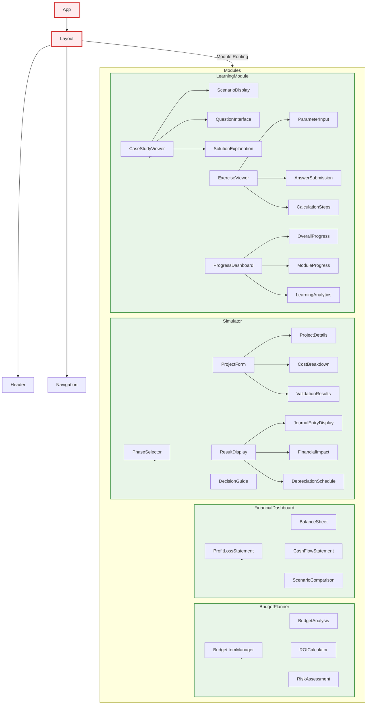
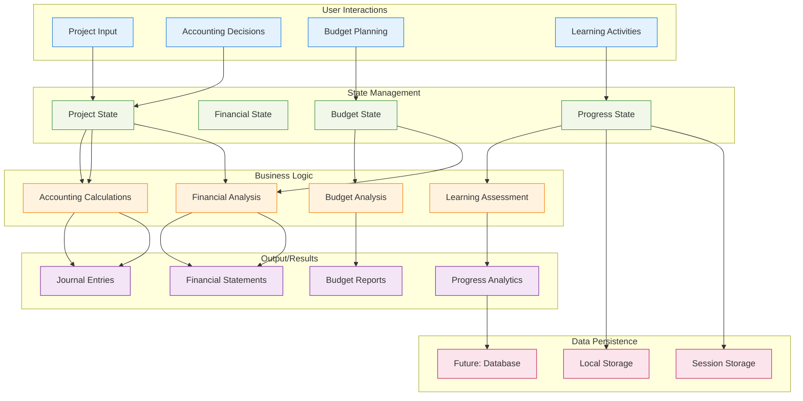

# アプリケーションアーキテクチャ

## システム概要

財務実践学習アプリケーションは、新任マネージャーがシステム開発における会計知識を実践的に学習するためのWebアプリケーションです。React + TypeScriptで構築され、モジュラー設計により拡張性と保守性を確保しています。

## アーキテクチャ図

```mermaid
graph TB
    subgraph "Frontend (React + TypeScript)"
        A[App.tsx] --> B[Layout/Navigation]
        B --> C1[Simulator Module]
        B --> C2[Financial Module] 
        B --> C3[Budget Module]
        B --> C4[Learning Module]
    end

    subgraph "Simulator Module"
        C1 --> D1[ProjectForm]
        C1 --> D2[DecisionGuide]
        C1 --> D3[ResultDisplay]
        D1 --> D4[CostBreakdown]
        D1 --> D5[JournalEntry]
    end

    subgraph "Financial Module"
        C2 --> E1[ProfitLossStatement]
        C2 --> E2[BalanceSheet]
        C2 --> E3[CashFlowStatement]
        C2 --> E4[FinancialComparison]
    end

    subgraph "Budget Module"
        C3 --> F1[BudgetPlanner]
        C3 --> F2[ROICalculator]
        C3 --> F3[RiskAnalysis]
        C3 --> F4[BudgetTemplates]
    end

    subgraph "Learning Module"
        C4 --> G1[CaseStudyViewer]
        C4 --> G2[ExerciseViewer]
        C4 --> G3[ProgressDashboard]
        C4 --> G4[LearningAnalytics]
    end

    subgraph "Data Layer"
        H1[Types & Interfaces]
        H2[Utility Functions]
        H3[Static Data]
        H4[Validation Logic]
    end

    subgraph "External Systems (Future)"
        I1[User Management API]
        I2[Progress Storage API]
        I3[Analytics Service]
        I4[Notification Service]
    end

    C1 --> H1
    C2 --> H1
    C3 --> H1
    C4 --> H1

    G3 --> I2
    G4 --> I3
    
    classDef moduleStyle fill:#e1f5fe,stroke:#0277bd,stroke-width:2px
    classDef dataStyle fill:#f3e5f5,stroke:#7b1fa2,stroke-width:2px
    classDef externalStyle fill:#fff3e0,stroke:#ef6c00,stroke-width:2px,stroke-dasharray: 5 5

    class C1,C2,C3,C4 moduleStyle
    class H1,H2,H3,H4 dataStyle
    class I1,I2,I3,I4 externalStyle
```

## コンポーネント階層図

## データフロー図

## 技術スタック

### フロントエンド
- **React 18**: UIライブラリ
- **TypeScript**: 型安全性と開発効率
- **Custom CSS**: Tailwind風のユーティリティクラス
- **React Hooks**: 状態管理とライフサイクル

### データ管理
- **TypeScript Interfaces**: 型定義による安全性
- **Utility Functions**: ビジネスロジックの分離
- **Static Data**: ケーススタディと演習問題
- **Local State**: React useState/useEffect

### 計算エンジン
- **会計計算**: 減価償却、仕訳生成
- **財務分析**: ROI、IRR、NPV計算
- **予算分析**: 分散分析、リスク評価
- **学習分析**: 進捗追跡、推奨システム

## 設計原則

### 1. モジュラー設計
各機能を独立したモジュールとして設計し、相互依存を最小化。

### 2. 型安全性
TypeScriptによる厳密な型定義で実行時エラーを防止。

### 3. 再利用可能性
共通コンポーネントとユーティリティ関数による重複排除。

### 4. 拡張性
新しい機能やモジュールを容易に追加できる構造。

### 5. ユーザビリティ
直感的なUI/UXと段階的な学習体験。

## パフォーマンス考慮事項

### 1. コンポーネント最適化
- React.memo による不要な再レンダリング防止
- useCallback/useMemo による計算結果キャッシュ
- 条件付きレンダリングによるDOM負荷軽減

### 2. データ構造最適化
- 効率的な配列操作とオブジェクト参照
- 計算結果の適切なキャッシュ戦略
- メモリリークの防止

### 3. 将来的な最適化
- Code Splitting による初期ロード時間短縮
- Service Worker によるオフライン対応
- CDN活用による静的アセット配信最適化