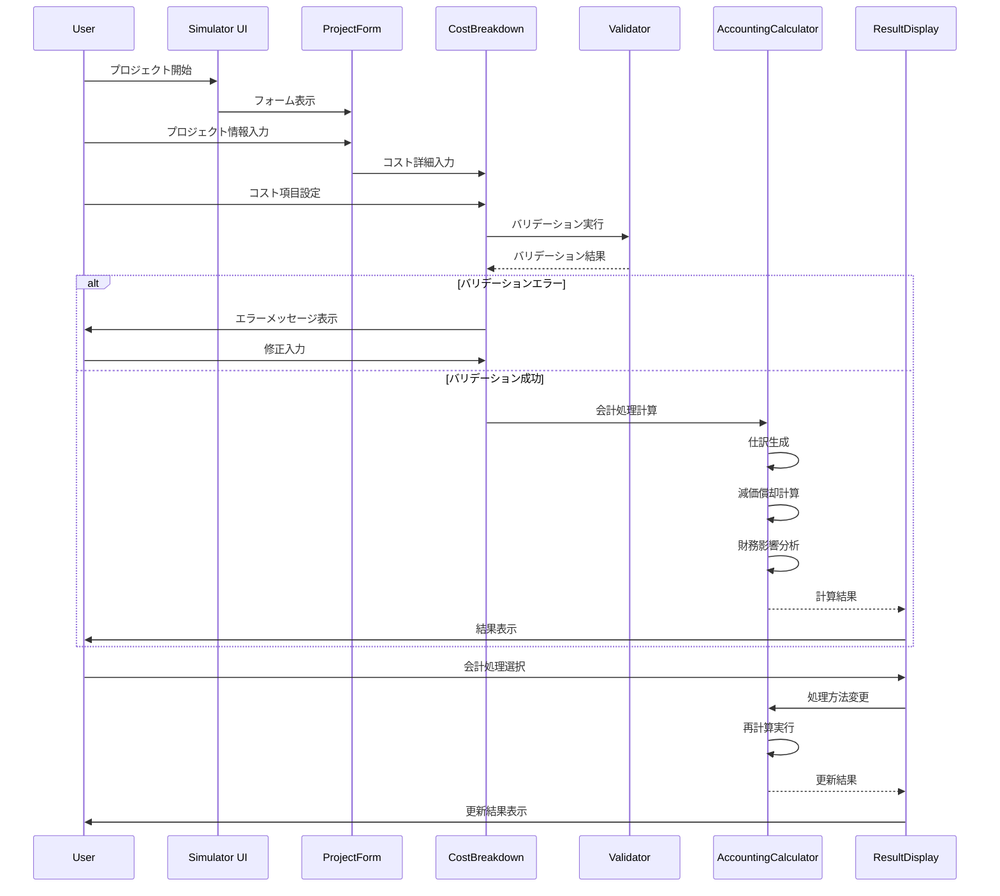
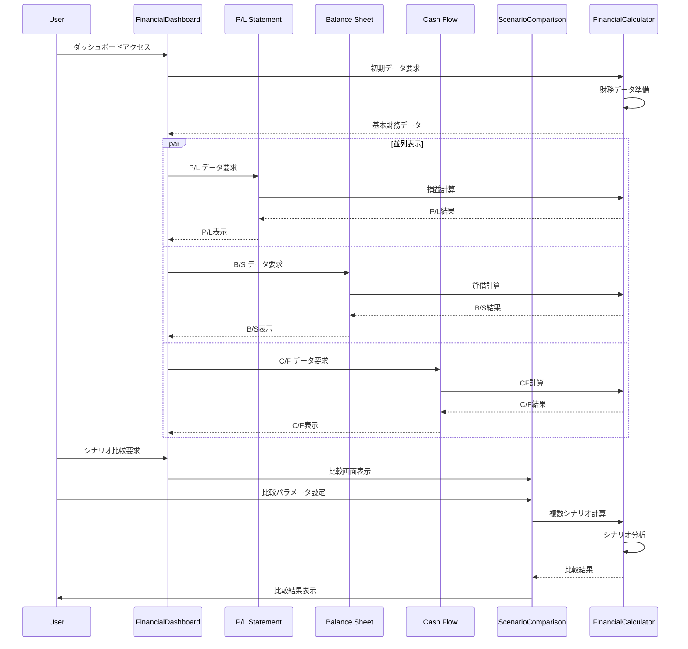
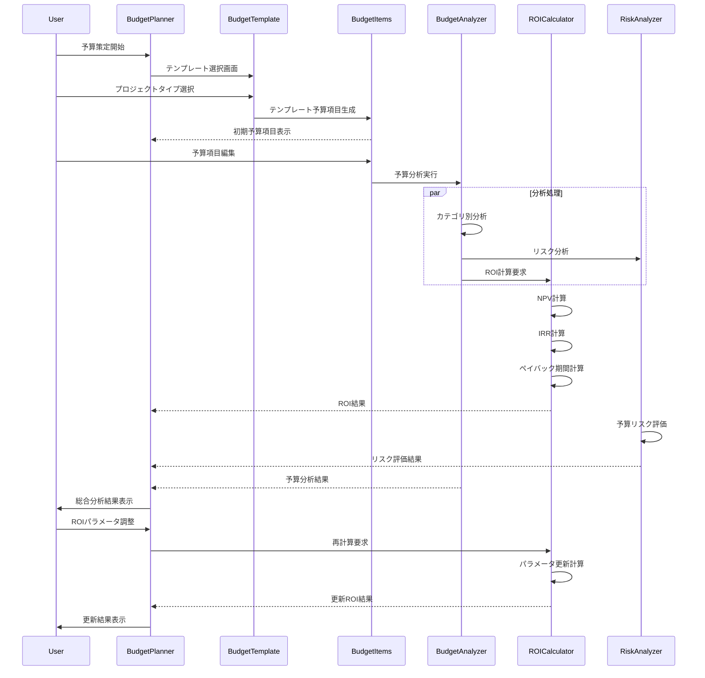
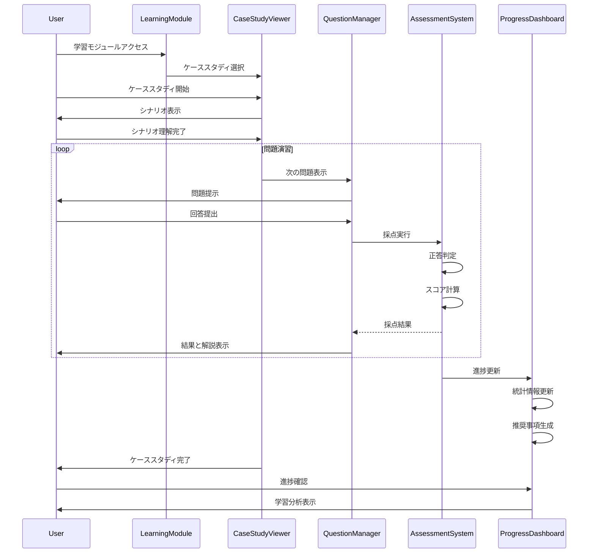
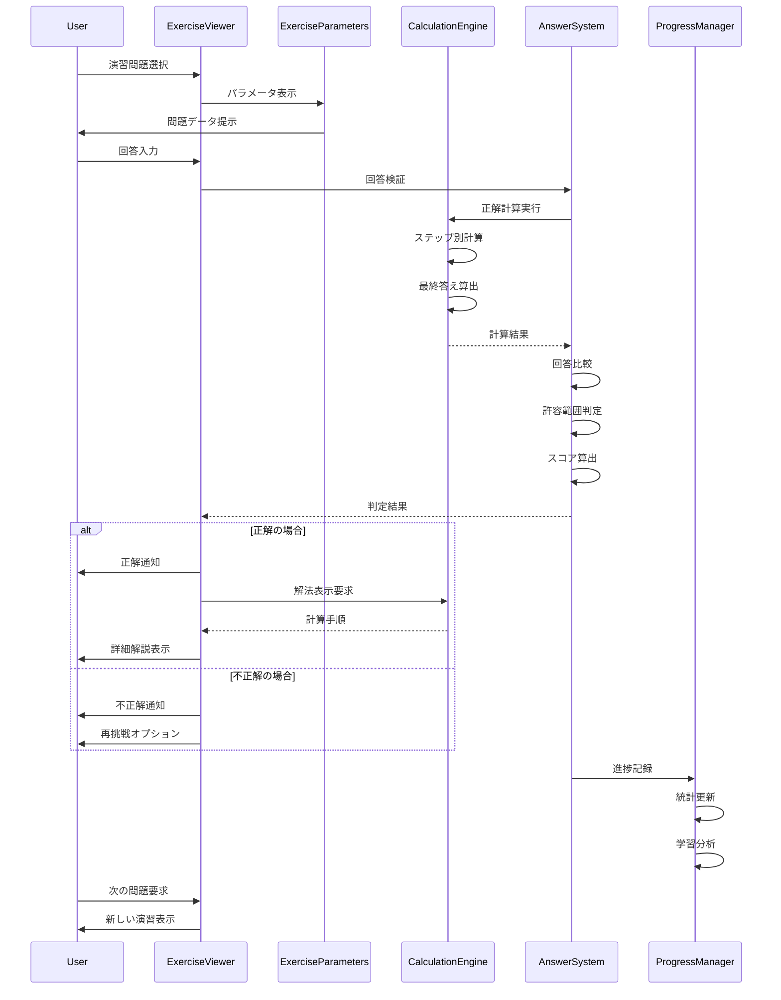
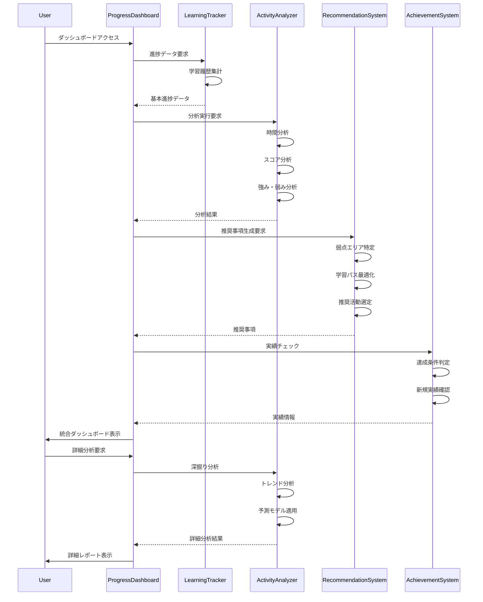
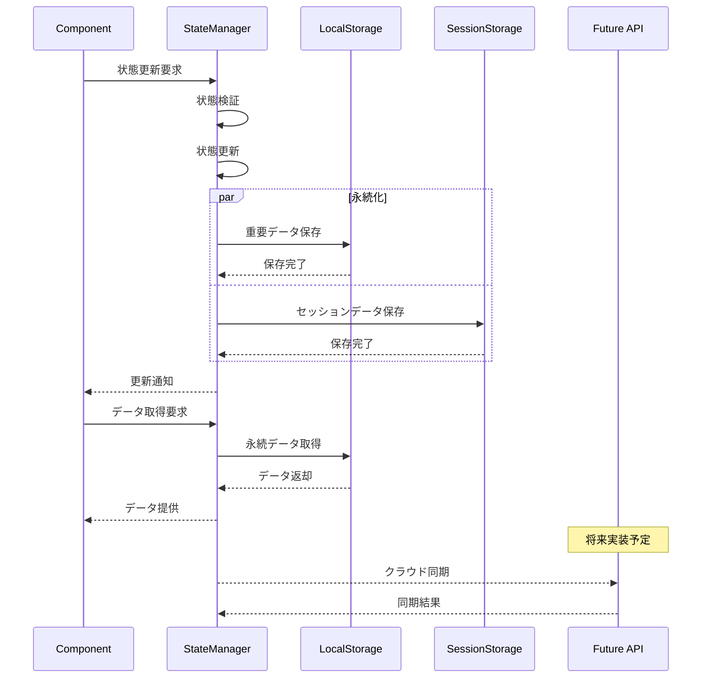
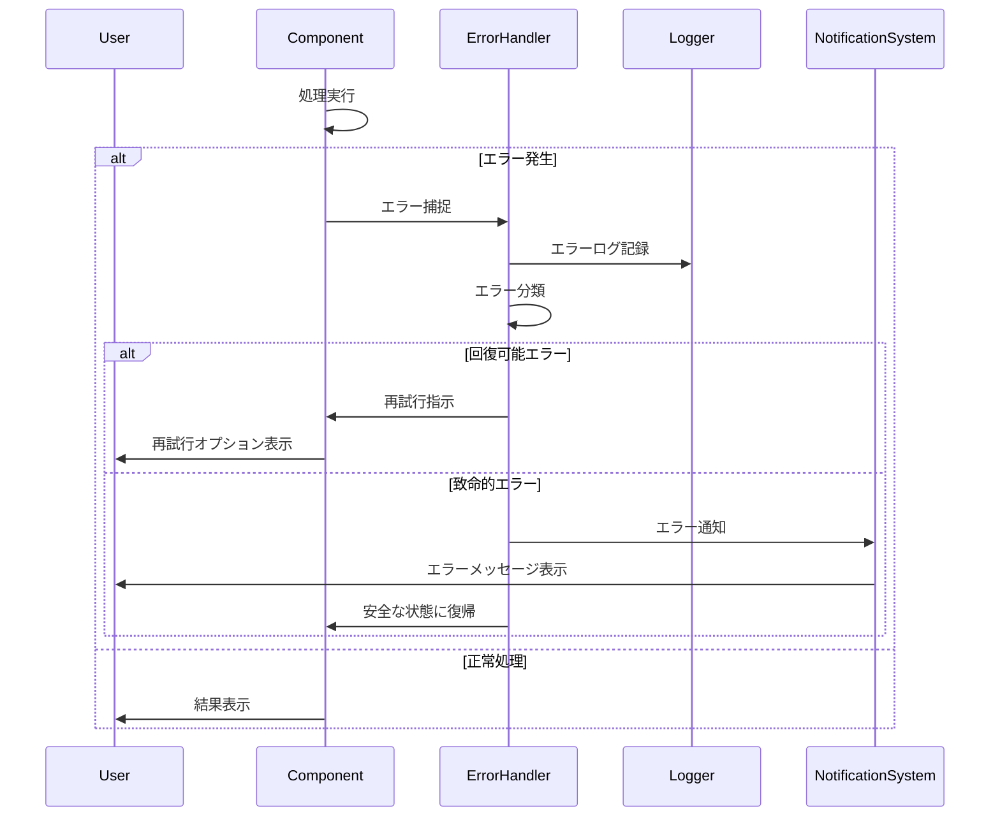

# シーケンス図

## 1. システム開発シミュレーション フロー

## 2. 財務三表ダッシュボード フロー

## 3. 予算策定・ROI分析 フロー

## 4. 学習モジュール - ケーススタディ フロー

## 5. 学習モジュール - 演習問題 フロー

## 6. 進捗管理・学習分析 フロー

## 7. データ永続化・状態管理 フロー

## エラーハンドリング パターン

これらのシーケンス図は、アプリケーションの主要な機能フローと、各コンポーネント間の相互作用を詳細に示しています。開発者がシステムの動作を理解し、新機能を追加する際の参考として活用できます。