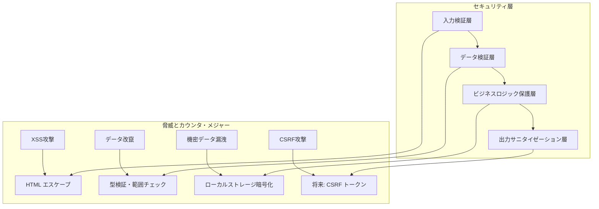

# 技術仕様書

## システム構成概要

### アプリケーション層

**📋 レイヤー構成図**: [html/architecture/layer-structure.html](html/architecture/layer-structure.html)

アプリケーションは4つの明確に分離されたレイヤーで構成されています：

- **🎨 プレゼンテーション層**: React Components、Navigation System、UI/UX Interface
- **⚙️ ビジネスロジック層**: 会計計算エンジン、財務分析ロジック、学習評価エンジン
- **📊 データアクセス層**: TypeScript Types、State Management、Data Validation
- **🔧 インフラストラクチャ層**: React Runtime、Build Tools、Browser APIs

## モジュール依存関係図

**📋 依存関係図**: [html/architecture/module-dependencies.html](html/architecture/module-dependencies.html)

階層的な依存関係構造により、保守性と拡張性を確保：

1. **App Level**: App.tsx（エントリーポイント）
2. **Layout Level**: Layout、Header、Navigation（レイアウト管理）
3. **Module Level**: 4つの主要機能モジュール（Simulator、Financial、Budget、Learning）
4. **Component Level**: 個別コンポーネント（ProjectForm、P/L Statement等）
5. **Utility Level**: 計算・検証ロジック（accounting.ts、financial.ts等）

## データモデル構造

### 型定義階層

```typescript
// 基本型定義
export interface BaseEntity {
  id: string;
  createdAt: string;
  updatedAt: string;
}

// プロジェクト関連
export interface Project extends BaseEntity {
  name: string;
  description: string;
  phase: ProjectPhase;
  budget: number;
  timeline: number;
  costBreakdown: CostBreakdown;
}

// 財務関連
export interface FinancialStatement {
  period: string;
  profitLoss: ProfitLossStatement;
  balanceSheet: BalanceSheet;
  cashFlow: CashFlowStatement;
}

// 学習関連
export interface LearningActivity extends BaseEntity {
  userId: string;
  activityType: ActivityType;
  progress: number;
  score?: number;
  timeSpent: number;
}
```

## パフォーマンス最適化戦略

**📋 最適化戦略詳細**: [html/performance/optimization-strategy.html](html/performance/optimization-strategy.html)

6つのカテゴリで段階的にパフォーマンスを向上：

### 高優先度
- **🚀 レンダリング最適化**: React.memo、useCallback、useMemo活用（目標: <100ms）
- **💾 メモリ管理**: リーク防止、適切な破棄処理（目標: <50MB）

### 中優先度  
- **📦 バンドル最適化**: Code Splitting、Tree Shaking（目標: <500KB）
- **🔄 データ処理最適化**: debounce/throttle、Web Worker（目標: <500ms）

### 低優先度
- **🌐 ネットワーク最適化**: Service Worker、CDN（目標: <2秒）
- **📱 モバイル最適化**: PWA対応、タッチ最適化（目標: >90スコア）

## セキュリティ設計

### セキュリティ層構成



## 監視・ロギング設計

```typescript
// ログ設計
interface LogEntry {
  timestamp: string;
  level: 'DEBUG' | 'INFO' | 'WARN' | 'ERROR';
  component: string;
  action: string;
  userId?: string;
  sessionId: string;
  metadata?: Record<string, any>;
}

// パフォーマンス監視
interface PerformanceMetric {
  name: string;
  startTime: number;
  endTime: number;
  duration: number;
  component: string;
  action: string;
}

// エラー追跡
interface ErrorReport {
  error: Error;
  componentStack: string;
  errorBoundary?: string;
  userAgent: string;
  timestamp: string;
  reproduction: {
    steps: string[];
    data: any;
  };
}
```

## 拡張可能性設計

**📋 プラグインアーキテクチャ**: [html/extensibility/plugin-architecture.html](html/extensibility/plugin-architecture.html)

将来の機能拡張に対応するプラグインシステム設計：

### 実装状況
- **✅ 実装済み**: モジュラー設計、型安全性、計算エンジン抽象化
- **🔧 次期実装予定**: テーマシステム、多言語対応、レポート生成
- **🌐 外部統合**: API連携、クラウド同期、リアルタイム機能
- **📊 高度分析**: ML予測、ベンチマーク、業界別テンプレート
- **🤝 コラボレーション**: チーム機能、共有ワークスペース
- **🎯 AI/ML統合**: 個人化学習、自動分析、予測ダッシュボード

### 技術仕様
- **プラグイン形式**: ES Modules with TypeScript
- **通信方式**: Event-driven architecture
- **UI統合**: React component injection
- **セキュリティ**: CSP + runtime permissions

## 開発・運用ガイドライン

### コーディング規約

```typescript
// 命名規則
interface NamingConventions {
  // コンポーネント: PascalCase
  components: 'ProjectForm' | 'BudgetPlanner';
  
  // フック: use + PascalCase
  hooks: 'useAccountingCalculation' | 'useBudgetAnalysis';
  
  // ユーティリティ関数: camelCase
  utilities: 'calculateROI' | 'generateJournalEntries';
  
  // 定数: UPPER_SNAKE_CASE
  constants: 'DEFAULT_DEPRECIATION_YEARS' | 'MAX_BUDGET_ITEMS';
  
  // 型定義: PascalCase + 接尾辞
  types: 'ProjectData' | 'BudgetAnalysis' | 'LearningProgress';
}

// ファイル構成規則
interface FileStructure {
  components: '/src/components/{ModuleName}/{ComponentName}.tsx';
  types: '/src/types/{domain}.ts';
  utilities: '/src/utils/{domain}Utils.ts';
  data: '/src/data/{dataType}.ts';
  styles: '/src/styles/{component}.css';
  tests: '/src/__tests__/{component}.test.ts';
}
```

### テスト戦略

```typescript
// テストピラミッド
interface TestStrategy {
  unit: {
    target: 'ユーティリティ関数、計算ロジック';
    coverage: '90%以上';
    tools: 'Jest + React Testing Library';
  };
  
  integration: {
    target: 'コンポーネント間連携';
    coverage: '80%以上';
    tools: 'Jest + React Testing Library';
  };
  
  e2e: {
    target: 'ユーザーフロー全体';
    coverage: '主要シナリオ';
    tools: 'Cypress（将来実装）';
  };
}
```

このように、アプリケーションのアーキテクチャと技術仕様を体系的に文書化することで、開発者が効率的に理解・保守・拡張できる基盤を提供しています。